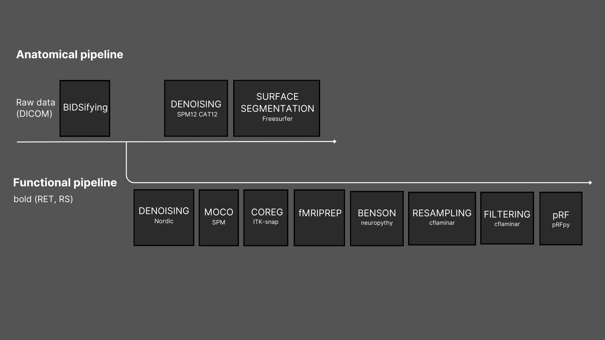
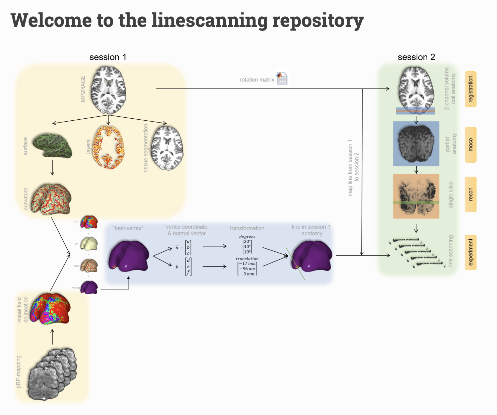

# EGRET3APreproc



## The overview  
This preprocessing pipeline is tailored for handling anatomical and functional MRI data collected using a 3T machine. We employ the Habrok cluster at the University Medical Center Groningen (UMCG), University of Groningen, The Netherlands, to carry out these tasks. The execution of various pipeline steps relies on an existing repository, the Linescanning.
For general information about the cluster, visit: [Hábrók cluster](https://wiki.hpc.rug.nl/habrok/introduction/what_is_a_cluster). 
For additional details on linescanning, visit: [linescanning repository](https://linescanning.readthedocs.io/en/latest/index.html).

### The Hábrók Cluster Installation


Access to the Hábrók cluster is open to all university staff upon request. Students can also obtain access if it is necessary for their courses, bachelor's, or master's research projects, provided they furnish project details, including the supervisor or teacher's name. To request access, you must complete the online form available on the CIT self-service portal Iris at: https://iris.service.rug.nl/. 
The form is located under "Research and innovation support," "Computing & facilities," and "Computing (Hábrók, Merlin)." Alternatively, you can search for "Habrok." The form requires your name and university account number, along with a brief description of why access is needed. 


- Install Python 3.9.6

```python
# Access your home directory  
cd homexx/pxxxxxx/ 

# Unload pre-existing modules
module purge

# Load the Python module
module load Python/3.9.6-GCCcore-11.2.0-bare

# Verify the installation was successful and that the right version was loaded
module list
python3 --version 
```

- Set up a virutal enviroment in your home directory

```python
# Create the virtual enviroment 
python3 -m venv $HOME/venvs/preproc

# Activate the virtual enviroment
source $HOME/venvs/preproc/bin/activate

# Update pip and wheel
pip install --upgrade pip
pip install --upgrade wheel
```

- Insert the following in your your bash_profile

```python
# Modify the bash_pofile
nano ~/.bash_profile
```

```bash
# Set up your bash_profile to load Python and the venv preproc every time is started
# Leave this part unchanged 
# Get the aliases and functions
if [ -f ~/.bashrc ]; then
        . ~/.bashrc
fi

# User specific environment and startup programs
module purge
module load Python/3.9.6-GCCcore-11.2.0-bare
source $HOME/venvs/preproc/bin/activate
```
  
```python
# Save and exit the bash_profile
# Make the changes of the bash_profile permanent
source ~/.bash_profile
```

### The Linescanning Repository Installation



The preprocessing steps are executed using an existing repository known as linescanning created by the Spinoza Centre for Neuroimgaging in Amsterdam, The Netherlands. The primary objective of this package is to generate highly accurate segmentations (both volumetric and surface) by integrating various software packages such as fMRIprep, FreeSurfer, CAT12, and SPM. 

- Create the directory where the linescanning will be stored

```python
# Navigate into your home directory 
mkdir programs

# Create a new folder and access it
cd programs
```

- Clone the linescanning repository
  
```python
# Clone the linescanning via git clone
git clone https://github.com/gjheij/linescanning.git
```

- Install the necessary requirements
  
```python
# Navigate into the linescannig folder 
cd linescanning

# Install the requirements 
pip install -r requirements.txt

# Bash the setup file
bash ~/programs/linescanning/shell/spinoza_setup setup

# Save and exit the bash_profile
# Make the changes of the bash_profile permanent 
source ~/.bash_profile
```

- Verify the installation

```python
# Make sure the files are executable
chmod -R 775 bin
chmod -R 775 shell

# Test the installation with 
python -c "import linescanning"

# If no error was given, the installation was successful. To test the bash environment, enter the following:
master
```
  
- Move the setup and the license file 

```python
# Navigate the scratch directory
cd scratch/pxxxxxx/

# Create a new folder to store the files
mkdir programs

# Copy the setup file into this directory 
cp /homexx/pxxxxxx/programs/linescanning/shell/spinoza_setup /scratch/pxxxxxx/programs/spinoza_setup

# Copy the license file into this directory
cp /homexx/pxxxxxx/programs/linescanning/misc/license.txt /scratch/pxxxxxx/programs/license.txt

# Verify whether it worked
cd programs
ls 
```

- Update your bash profile
  
```python
# Modify the bash_pofile
nano ~/.bash_profile
```

```bash
# Cancel the line insterted by the linescanning-repository
source /homex/pxxxxxx/programs/linescanning/bin/spinoza_setup
# Replace it by this line (the directory where the spinoza_setup file has been previously copied)
source /scratch/pxxxxxx/programs/spinoza_setup

# Add this line 
export FS_LICENSE=/scratch/p315561/programs/license.txt
```

```python
# Modify the path in the /homex/pxxxxxx/programs/linescanning/bin/spinoza_setup personalizing it: 
export REPO_DIR=/homex/pxxxxxx/programs/linescanning
```

```python
# Save the changes and exit the bash_profile
# Make the changes of the bash_profile permanent
source ~/.bash_profile
```

- Install the required packages are available in the Hábrók cluster
  
```python
# Modify the bash_pofile
nano ~/.bash_profile
```

```bash
# Add this lines under the module load Python/3.9.6-GCCcore-11.2.0-bare and before the source $HOME/venvs/preproc/bin/activate
module load ANTs/2.5.0-foss-2022b
module load FreeSurfer/7.3.2-centos8_x86_64
module load MATLAB/2022b-r5
module load ITK-SNAP/3.8.0-20190612
module load FSL/6.0.5.2-foss-2022b
```

```bash
# Add this line at the end of the bash profile to set up  Freesurfer 
export SUBJECTS_DIR=$DIR_DATA_DERIV/freesurfer
source $FREESURFER_HOME/FreeSurferEnv.sh
```

```python
# Save the chnages nad exit the bash_profile
# Make the changes of the bash_profile permanent
source ~/.bash_profile
```

- Install SPM12 

SPM12 installation steps can be followed on the official website accessible via this link: [SPM12](https://www.fil.ion.ucl.ac.uk/spm/software/spm12/).
The software is available after completing a brief Download Form specifying the following settings: 
        SPM Version: SPM12
        MATLAB Version: 2022b
        
SPM12 will then be downloaded and saved locally on your laptop in a folder.

```python
# Load the SPM12 folder from your laptop to the habrok cluster in your laptop terminal 
cd /where/your/downloaded/spm12/folder/is/stored
scp -r pxxxxxx@login2.hb.rug.nl:/homexx/pxxxxxx/programs .

# Start MATLAB in the Habrok terminal
cd /homexx/pxxxxxx
matlab

# Type the following in the MATLAB prompt
addpath /homexx/pxxxxxx/programs/spm12
```

- Install CAT12
CAT12 installation steps can be followed on the website accessible via this link: [CAT12](https://neuro-jena.github.io/cat/index.html#DOWNLOAD).

```python
# Load the CAT12 folder from your laptop to the habrok cluster in your laptop terminal 
cd /where/your/downloaded/cat12/folder/is/stored
scp -r pxxxxxx@login2.hb.rug.nl:/homexx/pxxxxxx/programs/spm12/toolbox .
```

- Install fMRIprep via Hábrók Apptainer Container

```python
# Navigate to the home directory and the interactive node 1 or 2 (not the login node)
cd homexx/pxxxxxx/ 

# Set up the Apptainer cache directory
export APPTAINER_CACHEDIR=/scratch/pxxxxxx/apptainer

# Pull the fMRIprep 20.2.7 image
apptainer pull  docker://nipreps/fmriprep:20.2.7
pip install slurm-wlm-torque ## Is this needed? (We did not run it with carolina)
```

```python
# Modify the bash_profile
nano ~/.bash_profile
```

```bash
# Add this line at the end of the bash profile to set up fMRIprep and make the python virtual enviroment accessible from the terminal 
export TEMPLATEFLOW_HOME=/scratch/pxxxxx/home2/pxxxxxx/.templateflow
export APPTAINERENV_TEMPLATEFLOW_HOME=${TEMPLATEFLOW_HOME}
export PYTHONPATH=‘/homexx/pxxxxxx/venvs/preproc/lib/python3.9/site-packages’
```

```python
# Modify the bash_profile
source ~/.bash_profile
```

- Personalize the spinoza_setup file

```python
# Navigate to the spinoza setup file 
cd /scratch/pxxxxxx/programs
nano spinoza_setup
```

Change at least the following fields (run e.g., gedit $your_folder/spinoza_setup):

```python
# The path to your setup file
export SETUP_FILE="${SETUP_DIR}/spinoza_setup"

# The project characteristics
export DIR_PROJECTS="YOUR_PROJECT_FOLDER"
export PROJECT="YOUR_PROJECT_NAME"
export TASK_SES1=("YOUR_TASK_NAMES") # if you have multiple tasks: ("task1" "task2") NO COMMA!!
```

### The CFLaminar Repository Installation


## Usage

Refer to the respective README file for specific instructions on how to use each tool.

## Contributing

Contributions are welcome! If you have any ideas for new preprocessing scripts/tools or improvements to existing ones, feel free to open an issue or submit a pull request.

Please adhere to the following guidelines when contributing:

Follow the existing coding style and conventions.
Ensure any new code is well-documented.
Test your changes thoroughly.

## License

This repository is licensed under the MIT License.
